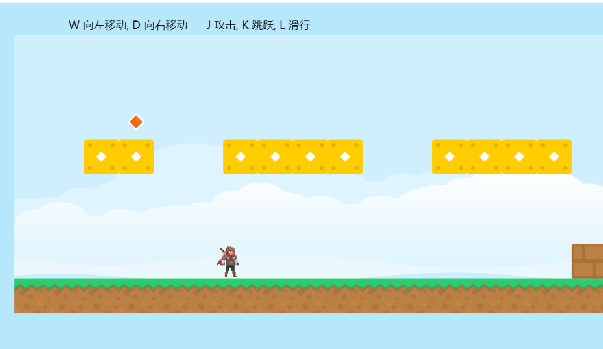

# phaser3-platform-game

## screenshots


## gif

## Project setup

install Parcel
```
npm install -g parcel-bundler
```
install dependencies
```
npm install 
```


### Compiles and hot-reloads for development

```
npm run start
```

### Compiles and minifies for production

```
npm run build
```
## License

[MIT License](https://github.com/ourcade/phaser3-parcel-template/blob/master/LICENSE)
